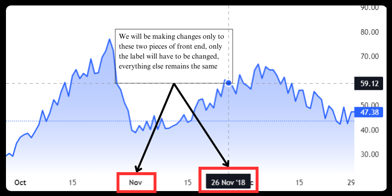

### 1. What is this?
------------
[Lightweight Charts](https://www.tradingview.com/lightweight-charts/ "Lightweight Charts") by TradingView is ~~one of~~ the best open source charting software out there. It's dynamic, its's interactive, it's too good, however, there is one small problem, it does not allow you to plot sequential data i.e., the x-axis has to be timeseries so you can only plot data with timestamps (unix timestamps or yyyy-mm-dd 00:00:00 format). If you wanted to plot x-axis with values `[1,2,3,...]`, it does not allow you to do that.  
This branch of Lightweight Charts does exactly that, it allows you to plot data with sequential data `[1, 2, 3 ,..]` or `[..., -3, -2, -1, 0, 1, ...]`.  
[Here](https://0vatsa.github.io/charts/lwc_sequential_data/shill/ "Here") is an example as to why you might want to use this.
### 2. Limitations
------------
- Does not yet support `float` on the x-axis, the feature will be added soon.
- Does not yet support `Bar (addBarSeries)` type graphs, other types work fine, this bug will also be handled soon.
- x-axis values will be equidistant, let's say you have x-axis values like this [1,3,5,10,100],
you would expect, on the graph, the distance between 3&5 and 10&100 to be different, but LightWeight Charts will plot equidistant connecting lines. 

### 3. !TODO
------------
- Need to add support for `float` type on the x-axis
- Need to add support for `Bar (addBarSeries)` graph
- Need to integrate with the [Python version of LightWeight Charts](https://github.com/louisnw01/lightweight-charts-python "Python version of LightWeight Charts")

### 4. Usage 
------------
- Every feature in the [documentation](https://tradingview.github.io/lightweight-charts/ "documentation") willl work as expected. 
- There is one extra thing you'll have to handle when using this,  
whenever you call `setData(data)` function, you'll need to add two more parameters, `targetCol` and `xAxisCol` (this will allow for targeted column plots):
	- `targetCol`: (string) the column name in `data` that needs to be plotted (y-axis) 
	- `xAxisCol`: (string) the column name in `data` that contains the x-axis values, if not provided, it will plot `1, 2, 3, ...` x-axis, for example:  
	
```javascript
const chart = LightweightCharts.createChart(document.body, { width: 400, height: 300, timeScale: {timeVisible: true, secondsVisible: true} });
const lineSeries = chart.addLineSeries();
lineSeries.setData([
    { id: 5,  pca1: 80.01 },
    { id: 10, pca1: 96.63 },
    { id: 15, pca1: 76.64 },
    { id: 20, pca1: 81.89 },
    { id: 25, pca1: 74.43 },
    { id: 30, pca1: 80.01 },
    { id: 35, pca1: 96.63 },
    { id: 40, pca1: 76.64 },
    { id: 45, pca1: 81.89 },
    { id: 50, pca1: 82.23 },
], "pca1", "id");
```
##### This will allow for targeted column plots. 
- CDN:  https://cdn.jsdelivr.net/gh/0vatsa/cdn@latest/lightweight_charts_for_sequential_data/lightweight-charts.standalone.development.js  
Or follow the Guide below, modify and run the code locally
- You can find some examples [here](https://github.com/0vatsa/0vatsa.github.io/tree/main/charts/lwc_sequential_data "here"), hosted at [1](https://0vatsa.github.io/charts/lwc_sequential_data/example_1/ "1"), [2](https://0vatsa.github.io/charts/lwc_sequential_data/example_2/ "2"), [3](https://0vatsa.github.io/charts/lwc_sequential_data/example_3/ "3"). 

### 5. Guide 
------------
This section describes exactly what changes you'll need to make to the codebase to make it sequential-data compatible.
#### 5.1 The Idea
We are just going to change two pieces  of front end, that's it, we won't touch anything else in the codebase. Every feature mentioned in the documentation will work as expected. 


#### 5.2 Steps 
First, we will just build from the source, the [instructions](https://github.com/tradingview/lightweight-charts/blob/master/BUILDING.md "instructions") are same as provided by LightWeight Charts themselves. 
- `git clone https://github.com/tradingview/lightweight-charts`
- `cd  lightweight-charts`
- `npm install `
- `cd website`
- `npm install`
- `cd ..`

Install typescript if you don't already have it 
- `npm install -g typescript`

Compiling 
- `npm run tsc `

Building
- `npm run rollup`
- `npm run build`

------------
After this in the `./dist/` folder you should have a `lightweight-charts.standalone.development.js` file, this is the file we will be making all the changes to.  
All line numbers mentioned here are for the version `4.2.1`, in other versions the line number may vary.
- Locate the class `SeriesApi`, in the version I am using this is at `line 12901`, in the classs, locate the function `setData` at line `12968`. Replace the entire function with:  

```javascript
setData(data, targetCol, xAxisCol) {
			
	let oldKey, newKey;
	
	if (targetCol===undefined){
		alert("in the function setData, 'targetCol' parameter is required");
		throw new Error("in the function setData, 'targetCol' parameter is required");
	}
	else {
		oldKey = targetCol;
		newKey = "value";
		data = data.map(dict => {
			if (oldKey in dict) {
				const { [oldKey]: value, ...rest } = dict;
					   return { ...rest, [newKey]: value };
			}
			return dict;
		})
	}
	if (xAxisCol===undefined){
		data = data.map((dict, index) => ({
			...dict,
			time: index + 1
		}));    
	}
	else {
		oldKey = xAxisCol;
		newKey = "time";
		data = data.map(dict => {
			if (oldKey in dict) {
				const { [oldKey]: value, ...rest } = dict;
					   return { ...rest, [newKey]: value };
			}
			return dict;
		})
	}
	checkItemsAreOrdered(data, this._private__horzScaleBehavior);
	checkSeriesValuesType(this._internal__series._internal_seriesType(), data);
	this._internal__dataUpdatesConsumer._internal_applyNewData(this._internal__series, data);
	this._private__onDataChanged('full');
}
```
- Locate the function `defaultTickMarkFormatter`, in the version I am using this is at `line 8125`, now in the last line of the function,  
replace:  
`return localDateFromUtc.toLocaleString(locale, formatOptions);`  
with:  
`return String(timePoint['_internal_timestamp']);`

- Locate the class `TimeAxisViewRenderer`, in the version I am using this is at `line 1297`, in the class locate the function `_internal_setData`, this is at `line 1301`, add th following lines of code inside the function:

```javascript
const __dateString = data['_internal_text'];

if ( (typeof __dateString == 'string') && (__dateString != '') ){
	data['_internal_text'] = convertToUnixTimestamp(__dateString);
}
```
- After this, we will just define the function `convertToUnixTimestamp` at the beginning of the file, go to about `line  8`, right after the `use strict` line, add the following lines:

```javascript
const months = {Jan: 0, Feb: 1, Mar: 2, Apr: 3, May: 4, Jun: 5,  Jul: 6, Aug: 7, Sep: 8, Oct: 9, Nov: 10, Dec: 11};
					  
function convertToUnixTimestamp(dateString) {

	const [day, month, year, time] = dateString.split(/[\s']+/);

	const date = new Date(Date.UTC(1900 + parseInt(year), months[month], parseInt(day), ...time.split(':').map(Number)));

	return Math.floor(date.getTime() / 1000);
}
```
That's it, those were the only modifications that had to be made.


